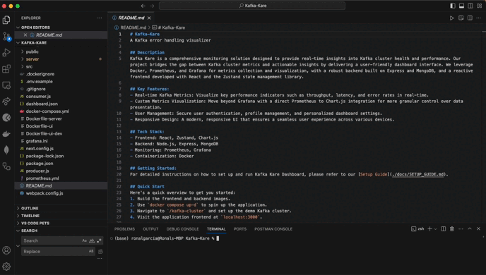

# Kafka-Kare

<p align="center">
  
</p>


## Table of Contents
1. [About](#about-kafka-kare)
2. [How it Works](#how-it-works)
3. [Getting Started](#getting-started-with-kafka-kare)
4. [Interested in Contributing?](#interested-in-contributing)
5. [Meet the Team](#meet-the-team)
6. [License](#license)


## About Kafka Kare
In the complex landscape of Apache Kafka ecosystems, monitoring data streams and detecting anomalies can be challenging. Kafka Kare addresses this challenge by offering a user-friendly interface to visualize Kafka topics, partitions, consumer groups, and more. 

With built-in alerting mechanisms, it empowers users to proactively identify issues such as lagging consumers, high throughput, or unusual patterns, ensuring the reliability and performance of Kafka deployments.

Kafka Kare is an open-source web application designed to provide powerful visualization capabilities and real-time alerting functionalities for Apache Kafka environments. It offers seamless integration with Kafka clusters, allowing users to monitor data streams, visualize key metrics, and set up Slack alerts for critical events.

## How it Works
Kafka Kare is built with:

[](https://www.javascript.com/)
[](https://kafka.apache.org/)
[](https://html.com/html5/)
[](https://developer.mozilla.org/en-US/docs/Web/CSS)
[](https://nodejs.org/)
[](https://react.dev/)
[](https://chakra-ui.com/)
[](https://nextjs.org/)
[](https://prometheus.io/)
[](https://grafana.com/)
[](https://expressjs.com/)
[](https://www.docker.com/)
[](https://www.chartjs.org/)
[](https://www.mongodb.com/)
[](https://jwt.io/)


Kafka Kare's key features include:
  - With its plug-and-play functionality, Kafka Kare allows users to add cluster connections with their port numbers. 
  - Once connected, real-time visualization of 22 key Kafka cluster metrics such as consumer lag, overall health of the cluster, and latency are available via Grafana-generated dashboards that 
    are supported by Prometheus.
  - Additionally, the alerting system allows users to define custom alert rules based on various Kafka metrics and thresholds. When predefined conditions are met, the system triggers alerts via 
    Slack, enabling timely response to potential issues and ensuring the stability of Kafka infrastructures.

Read more about our build process on Medium, here!   
    
## Getting Started With Kafka Kare

1. Fork and clone this repository then open it on your code editor of choice.
   - If you don't have it installed already, please set up Docker. The Kafka Kare team uses Docker Desktop: https://www.docker.com/products/docker-desktop/
   - To use Kafka Kare, you must have a containerized Kafka cluster set up to expose JMX data.
   - You can use [Confluent's Kafka images](https://registry.hub.docker.com/r/confluentinc/cp-kafka) with the `KAFKA_OPTS` environmental variable to run the Prometheus [JMX 
      Exporter](https://github.com/prometheus/jmx_exporter) as a Java agent. Your cluster should also be set up using a Docker bridge network to allow the Prometheus container to connect. See 
     [here](https://github.com/oslabs-beta/Kafka-Kare/tree/main/kafka-cluster) for an example.
2. Setup the .env file
   - Locate the **.env.example** file in the **root directory**. You will need to add your own JSON Web Token (JWT) secret key for security purposes: https://jwt.io/
   - You will also need to set up your own Next Auth URL and secret key for security purposes: https://next-auth.js.org/configuration/options
   - Optional: If you would prefer to use Github or Google OAuth for your login, please fill in the corresponding ID and Secret Key in the .env file as well.
     
<p align="center">
  
</p>
     
3. Spin up the application container by running the below command:
```
docker compose up -d
```
<p align="center">
  
</p>


### New to Kafka? Use steps 1 - 5 below to play around with our demo Kafka cluster!

  _1. Change directory to /kafka-cluster_
  ```
  cd kafka-cluster
  ```

  _2. (First time running the application) Build kafka cluster image_
  ```
  docker build -t dockerpromkafka:latest .
  ```

  _3. Spin up demo kafka-cluster container (demo Kafka-cluster container must be spun up after application container)_
  ```
  docker compose up -d
  ```

  _4. Run the consumer followed by producer script_
  ```
  node consumer.js
  node producer.js
  ```
  _5. Congratulations! You just set up your first Kafka cluster!_
     
     
4. Visit localhost:3000, create an account or log in. Click the 'Add Cluster' button, enter in the port number of your cluster, then click the dashboard button to start viewing your metrics!
5. Click the 3 lines to enter in your Slack URL and head to the Alerts page to configure your custom alerting thresholds.
6. Enjoy!

<p align="center">
  
</p>

## Instructions to stop the application
1. Spin down application container
```
docker compose down
```

2. Change directory to /kafka-cluster
```
cd kafka-cluster
```

3. Spin down demo kafka-cluster container
```
docker compose down
```
## Interested in Contributing?
Now seeking contributors to join the Kafka Kare team!

### How to Contribute 

To start contributing, please fork and clone Kafka Kare, create a feature branch with the pattern "(issue or feature)/what-you-are-working-on". 

When you are ready to submit a pull request to the **dev branch**, please follow the checklist closely and request at least two people to review and approve your code. You can refer to the Kafka Kare team members [here](#meet-the-team).

Prioritize any linked issues first before tackling the roadmap features and feel free to add any roadmap features as well that will continue to bring value to developers! We appreciate your support!

### Roadmap

| Feature                                                                               | Status    |
|---------------------------------------------------------------------------------------|-----------|
| Ability to plug in Kafka cluster to app                                               | ✅        |
| Metrics visualization with Grafana                                                    | ✅        |
| Save custom dashboard for users                                                       | ⏳        |
| Save historical data                                                                  | ⏳        |
| Alert history                                                                         | ⏳        |
| Custom notification configuration                                                     | 🙏🏻        |
| Migrate to KRaft                                                                      | 🙏🏻        |
| Shared state between any component shortcode                                          | 🙏🏻        |

- ✅ = Ready to use
- ⏳ = In progress
- 🙏🏻 = Looking for contributors

# Meet the Team!
<table>
  <tr>
    <td align="center">
      
      <br />
      <sub><b>Allison Scott</b></sub>
      <br />
      <a href="https://www.linkedin.com/in/allisonscott01/">🖇️</a>
      <a href="https://github.com/AllisonScott97">🐙</a>
    </td>
    <td align="center">
      
      <br />
      <sub><b>Matt Konop</b></sub>
      <br />
      <a href="https://www.linkedin.com/in/matt-konop-58a82b189/">🖇️</a>
      <a href="https://github.com/MattKonop">🐙</a>
    </td>
    <td align="center">
      
      <br />
      <sub><b>Justin Lin</b></sub>
      <br />
      <a href="https://www.linkedin.com/in/justin-tzuhung-lin">🖇️</a>
      <a href="https://github.com/JustinTzHLin">🐙</a>
    </td>
     <td align="center">
      
      <br />
      <sub><b>Jules Mai</b></sub>
      <br />
      <a href="http://www.linkedin.com/in/julesmai">🖇️</a>
      <a href="https://github.com/julesdmai">🐙</a>
    </td>
     <td align="center">
      
      <br />
      <sub><b>Ronal Garcia</b></sub>
      <br />
      <a href="https://www.linkedin.com/in/ronalgarcia/">🖇️</a>
      <a href="https://github.com/josuerole">🐙</a>
    </td>
</table>


- 🖇️ = LinkedIn
- 🐙 = Github

## License
This product is licensed under the MIT License without restriction.

